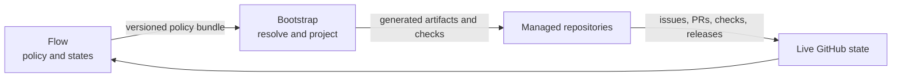

# ADR-0001: Make Flow the authority for Public Repository Standard v1

- Status: Accepted
- Date: 2026-07-11
- Accepted: 2026-07-15
- Decision owners: Flow maintainers
- Material notification: [Flow issue #8](https://github.com/OMT-Global/flow/issues/8) and the discovery pull request

## Context

Flow currently defines useful work states, autonomy classes, merge gates, and release states across Markdown, YAML, JSON Schema, issue templates, and agent guidance. Bootstrap separately encodes repository defaults and renders repository-local files. Neither repository currently exposes one versioned policy contract covering the full public-repository standard, so definitions can drift and consumers cannot pin an immutable policy version.

The operating boundary is:

## Decision

Flow will publish the authoritative, machine-readable Public Repository Standard v1 policy bundle and human-readable companion documentation.

The bundle will:

1. Define repository classes, product maturity, work and release transitions, material actions, notifications, human hard stops, ADR triggers, quality and security expectations, provenance requirements, exception semantics, and conformance outcomes.
2. Use publisher-neutral identifiers and leave publisher branding and spend thresholds to Bootstrap-resolved configuration.
3. Version its schema and policy data together under immutable SemVer releases. Production consumers must use an exact release or immutable commit SHA, never `main`.
4. Keep Flow responsible for semantics while Bootstrap owns parsing repository input, resolving defaults, projecting files and workflows, and validating conformance.
5. Treat policy changes as material. They require notification and review by an agent other than the author; defined hard stops and policy exceptions additionally require explicit human approval.
6. Preserve existing Flow contracts through an explicit compatibility and migration map until Bootstrap consumers have moved to the v1 bundle.

## Consequences

- Flow gains a new compatibility surface and must test schema validity, cross-reference integrity, and allowed state transitions.
- Existing autonomy and release documents remain useful but must become views of, or be checked against, the authoritative bundle.
- Bootstrap needs a resolver that consumes a pinned Flow bundle and rejects incompatible or unpinned policy sources.
- A policy release cannot silently change established semantics; breaking changes require a major version and migration guidance.
- Dogfooding Flow will expose conflicts between centrally generated policy files and product-owned architecture documentation.

## Alternatives considered

### Keep policy in prose only

Rejected because Bootstrap and CI cannot resolve or enforce prose deterministically.

### Put the complete policy model in Bootstrap

Rejected because it merges policy authority with projection mechanics and breaks the intended control-plane boundary.

### Create a second repository-local policy file

Rejected because `project.bootstrap.yaml` must remain the sole editable repository contract.

## Rollout

1. Land the vocabulary and schema without changing downstream behavior.
2. Add validation tests and publish an immutable Flow policy release.
3. Add Bootstrap consumption and compatibility mapping.
4. Dogfood against Flow and Bootstrap in dry-run mode before applying generated changes.
5. Remove superseded definitions only after managed repositories have a supported migration path.

Implementation is tracked by [#8](https://github.com/OMT-Global/flow/issues/8), [#9](https://github.com/OMT-Global/flow/issues/9), [#10](https://github.com/OMT-Global/flow/issues/10), [#11](https://github.com/OMT-Global/flow/issues/11), [#12](https://github.com/OMT-Global/flow/issues/12), and [#13](https://github.com/OMT-Global/flow/issues/13).

## Implementation evidence

The decision is implemented and released:

- [PR #15](https://github.com/OMT-Global/flow/pull/15) established the publisher-neutral policy bundle and schema.
- [PR #16](https://github.com/OMT-Global/flow/pull/16) made work and release transitions executable.
- [PR #17](https://github.com/OMT-Global/flow/pull/17) added contribution-lifecycle, review, and immutable-release contracts.
- [PR #18](https://github.com/OMT-Global/flow/pull/18) defined security response and provenance semantics.
- The immutable [v1.0.1 policy release](https://github.com/OMT-Global/flow/releases/tag/v1.0.1) was published and independently verified under [issue #23](https://github.com/OMT-Global/flow/issues/23).

Acceptance records the policy decision; it does not claim that every consumer has migrated. Flow's plan-first Bootstrap dogfood remains tracked by [issue #13](https://github.com/OMT-Global/flow/issues/13), and generated governance reconciliation remains tracked by [issue #25](https://github.com/OMT-Global/flow/issues/25).

## Security and privacy

The public policy bundle contains no secrets or private provenance. It defines redaction, hard-stop, and provenance-failure behavior. Physical private-sink details and credentials remain outside repository configuration.

## Revisit conditions

Revisit this decision if policy resolution cannot remain deterministic across supported Bootstrap versions, if a class cannot be represented without product-specific policy, or before introducing a permanent policy exception.
