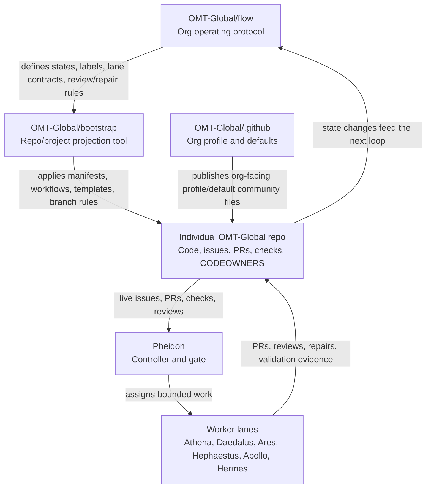

# OMT-Global Operating Map

This map defines where the organization-level operating rules live and how they reach individual repositories.

## Repository Roles

## Mental Model

- `OMT-Global/flow` is the operating protocol for the organization. It defines how work moves through issues, PRs, reviews, repairs, checks, merge gates, and worker lanes.
- `OMT-Global/bootstrap` is the tool and control plane used to project that policy into repositories. It should run against repos/projects to reconcile managed files, GitHub settings, workflow policy, labels, templates, and portable agent profiles.
- `OMT-Global/.github` is the organization profile/defaults repo. It is not the primary source for every per-repo workflow. Per-repo `.github/workflows/*` files are managed as repo-local surfaces by bootstrap policy unless a repo intentionally opts out.
- Individual repos remain the source of live product work: code, issues, PRs, checks, reviews, branch protection, CODEOWNERS, and repo-local manifests.

## Ownership Boundary

Flow owns the vocabulary and state machine. Bootstrap owns projection. Repos own live execution.

That split matters because it prevents three common failures:

- changing one repo without updating the org policy;
- documenting policy that the bootstrap tool cannot apply;
- letting local worker state drift away from live GitHub truth.

## Expected Loop

1. Update or clarify policy in `flow`.
2. Encode applicable repo changes in `bootstrap`.
3. Run bootstrap against each target repo in plan mode first.
4. Apply repo/GitHub/home targets deliberately.
5. Let GitHub issues, PRs, checks, labels, CODEOWNERS, and reviews become the visible control plane.
6. Let Pheidon and the worker lanes consume live GitHub state before local queue files.

## Rule Of Thumb

If the question is "how should OMT-Global work?", start in `flow`.

If the question is "how do we stamp that into repos?", use `bootstrap`.

If the question is "what is actually happening now?", read the individual repo's live GitHub state first.
